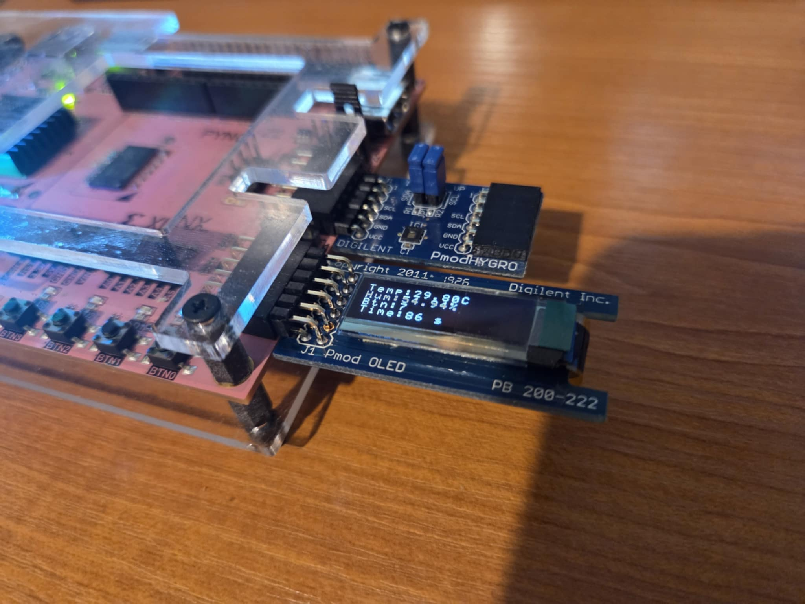
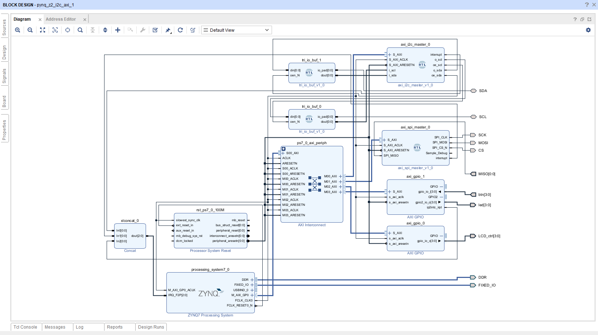
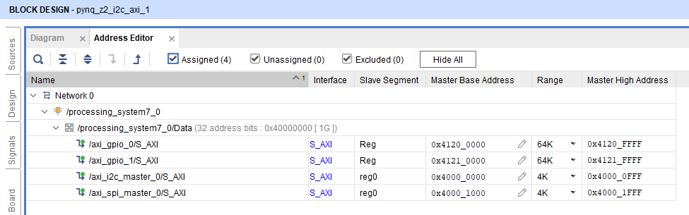
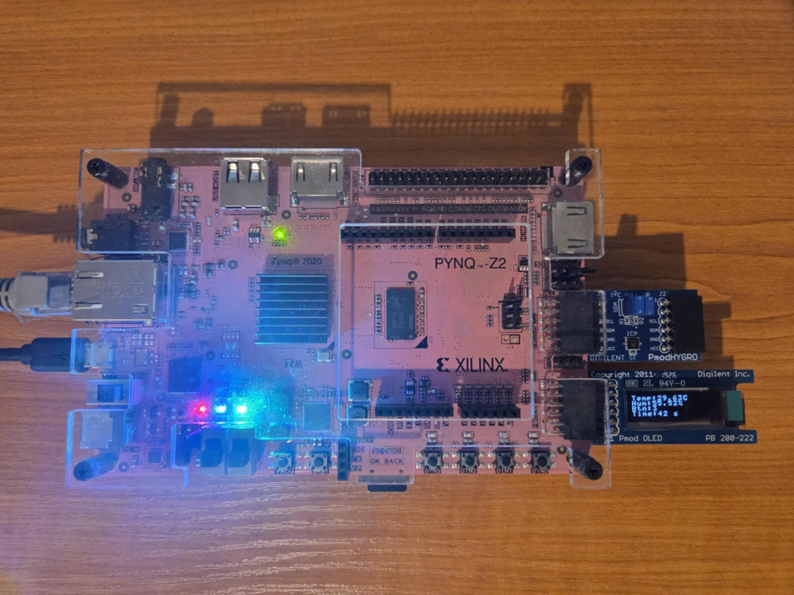
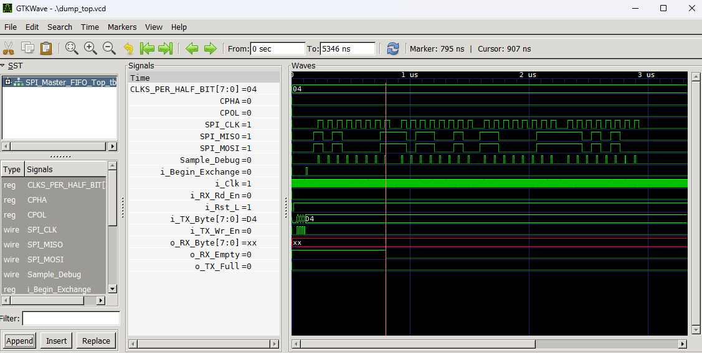
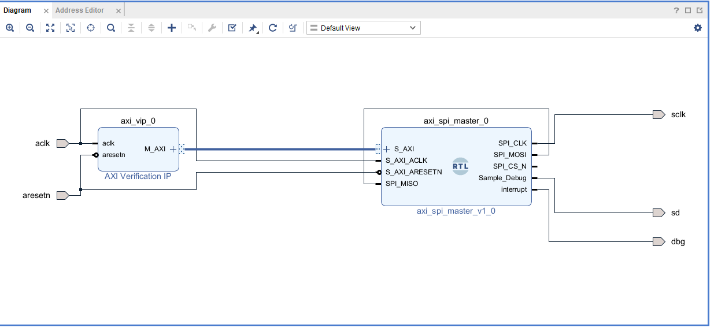
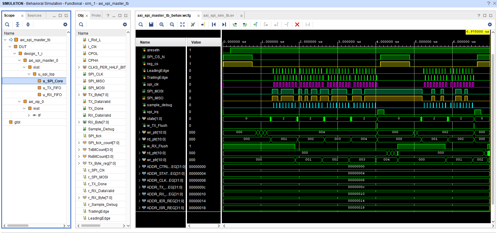
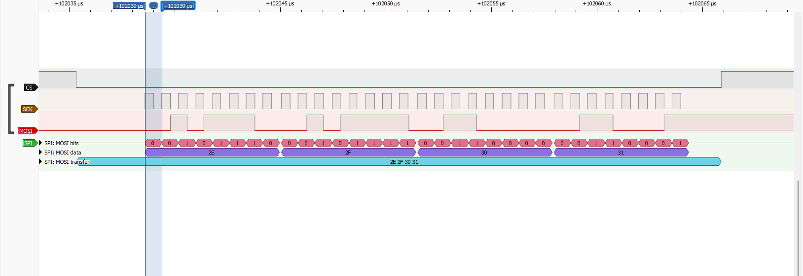

# Zynq FreeRTOS Temperature Monitor & OLED Controller

This project demonstrates a complete real-time embedded system on the Zynq-7000 platform (PYNQ-Z2). It integrates a **FreeRTOS** application running on the Processing System (PS) with custom, synthesizable **AXI4-Lite IP Cores** implemented in the Programmable Logic (PL) to interface with external sensors and displays.


*Figure 1: Project showcase.*
## Project Overview

The system reads temperature and humidity data from an **HDC1080** sensor via a custom I2C Master IP, processes user input from buttons via interrupts, and visualizes the system state on a **Pmod OLED** (SSD1306) display driven by a custom SPI Master IP.

### Key Features

*   **Real-Time Operating System:** Utilizes FreeRTOS for task scheduling, inter-task communication (Queues), and resource management.
*   **Custom FPGA IP Cores:**
    *   **AXI I2C Master:** Robust I2C controller with FIFOs and interrupt support.
    *   **AXI SPI Master:** High-speed SPI controller with configurable CPOL/CPHA and hardware FIFOs.
*   **Advanced Interrupt Handling:**
    *   Debounced button inputs using a hybrid ISR + Software Timer approach.
    *   GIC (Generic Interrupt Controller) integration for PL-to-PS interrupts.
*   **Inter-Task Communication:** Thread-safe data exchange between sensor acquisition, system tick, and display tasks using FreeRTOS Queues.

---

## Project Directory Structure

```plaintext
Zynq_TempMon_RTOS/
├── fpga/
│   ├── block_design_system/    # Vivado Block Design artifacts and address maps.
│   ├── spi_fpga_axi_tb/        # Vivado test bench simulation (AXI VIP).
│   ├── spi_rtl_tb/             # Testbench for pure RTL simulation (SPI).
│   └── spi_rtl/                # Verilog source files for SPI IP core.
├── software/
│   ├── freertos_main.c     # Main FreeRTOS Application.
│   ├── gpio_driver/        # Drivers for Buttons, LEDs, OLED GPIOs.
│   ├── hdc1080/            # HDC1080 Sensor Driver.
│   ├── i2c_axi_master/     # Custom I2C Master Driver.
│   ├── oled_driver/        # SSD1306 OLED Driver.
│   └── spi_axi_master/     # Custom SPI Master Driver.
├── software_test/
    ├── main_tst.c          # Bare-Metal software tests of the peripherals.

```

---

## System Architecture

The design partitions the workload between the PS and PL. The PL handles the strict timing requirements of the communication protocols (I2C/SPI), while the PS handles the application logic and scheduling.


*Figure 2: Vivado Block Design showing the Zynq PS connected to custom AXI I2C, AXI SPI, and AXI GPIO peripherals.*

The design partitions the workload between the PS and PL. The PL handles the strict timing requirements of the communication protocols (I2C/SPI), while the PS handles the application logic and scheduling.

The system consists of:
*   **AXI I2C Master:** Custom IP core.
*   **AXI SPI Master:** Custom IP core.
*   **AXI GPIO IP (Standard):** Configured with 4 output GPIOs for OLED display control.
*   **AXI GPIO IP (Standard):** Configured with 4 inputs (Channel 1) for buttons and 4 outputs (Channel 2) for LEDs. Each of the four buttons directly controls its corresponding LED (including the one used for the system heartbeat).

The system utilizes the Zynq's Generic Interrupt Controller (GIC) to handle asynchronous events from the Programmable Logic (PL). There are three distinct interrupt sources connected:
*   **AXI I2C Master**
*   **AXI SPI Master**
*   **GPIO Buttons**

Below is the AXI Adress map of the peripherals.


*Figure 3: Vivado Block Design AXI BUS Address map of peripherals.*

### Software Architecture (FreeRTOS)

The application is structured into three main tasks:

1.  **`I2cTempMeasure_Task`**: Periodically polls the HDC1080 sensor using the custom I2C driver. Pushes sensor readings to the Display Queue.
2.  **`TickGenerator_Task`**: Generates a system heartbeat and tracks uptime. It also manages the LED heartbeat via a critical section to prevent race conditions with the ISR.
3.  **`SpiOledDisplay_Task`**: The consumer task. It waits on the Display Queue and updates the OLED screen via the custom SPI driver whenever new data (Sensor, Tick, or Button events) arrives.

**Inter-Task Communication:**
The primary method of communication between tasks and ISRs is the `xDisplayQueue`. Data is encapsulated in a `DisplayMessage_t` structure, which supports multiple message types (Sensor Data, System Tick, Button Events).

```c
typedef struct {
    MsgType_t type;
    union {
        struct { float temperature; float humidity; } sensor;
        uint32_t tick;
        uint32_t button_count;
    } payload;
} DisplayMessage_t;
```

The system displays the temperature and humidity from the HDC1080 sensor, the number of button presses, and the time running of the system as shown on the screenshot below.



*Figure 4: Setup Normal Mode of operation of the application.*

**Interrupt Handling:**
*   **Buttons:** Triggers an ISR on the GIC. The ISR provides immediate visual feedback by toggling the corresponding LED, then disables interrupts and defers processing to a software timer for debouncing. Once the signal is stable, the timer callback (`vButtonTimerCallback`) increments the press counter and sends a `DisplayMessage_t` to the queue. Upon receiving this message, the display task shows a "BUTTON PRESSED!" notification for 600 ms to provide clear visual confirmation to the user, as shown below.


*Figure 5: Setup Interrupt Mode of operation of the application. Button press triggers an ISR.*


---

## Software Components & BSP

The `software` folder contains a complete Board Support Package (BSP) and a suite of custom drivers developed to abstract the hardware complexity. These drivers provide a clean API for the FreeRTOS application.

### 1. AXI SPI Master Driver
*   **Location:** `software/spi_axi_master/`
*   **Functionality:** Provides low-level control over the custom SPI IP core. It manages the hardware TX/RX FIFOs to ensure continuous, high-speed data transmission required for the OLED display.
*   **Features:** Supports dynamic reconfiguration of Clock Polarity (CPOL), Phase (CPHA), and **Clock Rate** (via prescaler), Supports both polled (blocking) and interrupt-driven (non-blocking) tranfers, and manual chip-select control.

### 2. AXI I2C Master Driver
*   **Location:** `software/i2c_axi_master/`
*   **Functionality:** A robust driver for the custom I2C IP. It handles the complex state machine required for I2C transactions, including Start/Stop generation, ACK/NACK detection, and bus arbitration.
*   **Features:** Supports both polled (blocking) and interrupt-driven (non-blocking) modes for Read, Write, and Write-then-Read exchanges. Configurable for **100 kHz, 400 kHz, and 1 MHz** bus speeds.

### 3. OLED Display Driver
*   **Location:** `software/oled_driver/`
*   **Functionality:** A high-level graphics driver for the Pmod OLED. It utilizes the **SPI Master Driver** for sending pixel data and the **OLED Control GPIOs** for side-band signals.
*   **Features:** Includes a built-in 8x8 ASCII font library, string rendering functions, and display initialization sequences.

### 4. HDC1080 Sensor Driver
*   **Location:** `software/hdc1080/`
*   **Functionality:** A device-specific driver built on top of the **I2C Master Driver**. It abstracts the sensor's register map into simple function calls.
*   **Features:** Configures the sensor for 14-bit resolution and provides easy-to-use `GetTemperature()` and `GetHumidity()` functions.

### 5. Button & LED Driver
*   **Location:** `software/gpio_driver/btn_led_driver`
*   **Functionality:** Manages the AXI GPIO instance connected to the 4 onboard Buttons and LEDs.
*   **Interrupts:** Implements a robust ISR that detects button presses, debounces inputs using FreeRTOS software timers, and notifies the application tasks via queues.
*   **Feedback:** Directly toggles the corresponding LED (including the Heartbeat LED) inside the ISR to provide zero-latency visual feedback to the user.

### 6. OLED Control GPIOs
*   **Location:** `software/gpio_driver/`
*   **Functionality:** Controls the critical power and signaling lines for the OLED display via a standard AXI GPIO controller.
*   **Signals:**
    *   **VBAT / VDD:** Power enable signals for the display logic and panel.
    *   **RES:** Hardware reset line.
    *   **D/C:** Data/Command selection pin, used to switch the display controller between command mode and pixel data mode.


---

## Hardware Setup

The project is designed for the **PYNQ-Z2** board.

!Hardware Setup
*Figure 3: PYNQ-Z2 connected to Pmod HYGRO and Pmod OLED.*

### Pinout Connections

| Peripheral | Pmod Connector | Pin | Signal | FPGA Pin |
|:---|:---|:---|:---|:---|
| **HDC1080 Sensor** | PMODA (Bottom) | 9 | SCL | W18 |
| | | 10 | SDA | W19 |
| **OLED Display** | PMODB (Top) | 1 | CS | W14 |
| | | 2 | MOSI | Y14 |
| | | 3 | MISO | T11 |
| | | 4 | SCK | T10 |
| | PMODB (Bottom) | 7 | LCD_ctrl[0] | V16 |
| | | 8 | LCD_ctrl[1] | W16 |
| | | 9 | LCD_ctrl[2] | V12 |
| | | 10 | LCD_ctrl[3] | W13 |
| **Buttons** | Onboard | 0 | btn[0] | D19 |
| | | 1 | btn[1] | D20 |
| | | 2 | btn[2] | L20 |
| | | 3 | btn[3] | L19 |
| **LEDs** | Onboard | 0 | led[0] | R14 |
| | | 1 | led[1] | P14 |
| | | 2 | led[2] | N16 |
| | | 3 | led[3] (Heartbeat) | M14 |

---

## Custom IP Cores

This project relies on two custom-built AXI4-Lite IP cores.

### 1. AXI I2C Master IP
*For full documentation, register maps, and implementation details, please visit the standalone project repository: [Zynq I2C AXI Custom Master Core](https://github.com/Dekameron55/Zynq_I2C_Axi_Custom_Master_Core/tree/main).*

This core handles I2C communication with the HDC1080. It features internal FIFOs, programmable prescalers, and a robust state machine that handles ACK/NACK errors and bus arbitration.

### 2. AXI SPI Master IP

A custom SPI Master core designed for high-throughput display updates.

**Features:**
*   **Configurable Modes:** Supports all 4 SPI modes (0-3) via software-configurable CPOL (Clock Polarity) and CPHA (Clock Phase).
*   **Hardware FIFOs:** Internal TX and RX FIFOs (Block RAM based) allow the software to burst write data without waiting for serialization.
*   **Manual Start:** "Pre-load then Fire" mechanism allows filling the FIFO before triggering the transaction to ensure continuous clock generation.
*   **Programmable Speed:** Flexible clock divider to support various SPI slave speeds derived from the system AXI clock.
*   **Interrupt Support:** Dedicated interrupts for 'Transaction Done' and 'TX FIFO Half Empty' to enable efficient, non-blocking streaming.
*   **Manual Chip Select:** Software control over the Chip Select line for complex slave protocols.

#### SPI Register Map

| Offset | Register Name | Access | Description |
|:---|:---|:---|:---|
| `0x00` | **Control Register** | R/W | Bit 0: `CPOL` (Clock Polarity), Bit 1: `CPHA` (Clock Phase). |
| `0x04` | **Status Register** | R | Bit 0: `TX_FULL`, Bit 1: `RX_EMPTY`, Bit 2: `BUSY`. |
| `0x08` | **Clock Divider** | R/W | Bits 7:0: `CLKS_PER_HALF_BIT`. Formula: `F_spi = F_axi / (2 * val)`. Ex: `100MHz / (2*4) = 12.5MHz`. |
| `0x0C` | **TX Data** | W | Write 8-bit data to push to TX FIFO. |
| `0x10` | **RX Data** | R | Read 8-bit data to pop from RX FIFO. |
| `0x14` | **Interrupt Enable** | R/W | Bit 0: `TX_HALF_EMPTY_IE`, Bit 1: `DONE_IE`. |
| `0x18` | **Interrupt Status** | R/W1C | Bit 0: `TX_HALF_EMPTY`, Bit 1: `DONE` (Write-1-to-Clear). |
| `0x1C` | **Chip Select** | R/W | Bit 0: `CS_N` (Manual Chip Select, Active Low). |
| `0x20` | **Version** | R | Returns IP Version (e.g., `0x00010300`). |
| `0x24` | **Start Register** | W | Bit 0: `BEGIN_EXCHANGE` (Write 1 to start transaction). |
| `0x28` | **Reset Register** | W | Bit 0: `SW_RESET` (Write 1 to reset core). |

### SPI Master Verification Strategy

The SPI Master IP underwent a rigorous two-stage verification process to ensure robustness before system integration.

#### Level 1: RTL Core Verification
To ensure a stable foundation, the core SPI logic (FIFO, State Machine, Shift Register) was first verified at the RTL level without the complexity of the AXI interface. This step-by-step approach allowed for isolated debugging of the core protocols.

*   **Testbench:** `fpga/spi_rtl_tb/SPI_Master_FIFO_Top_tb.sv`
*   **Tools:** Icarus Verilog, GTKWave.
*   **Method:** A simple loopback test (MOSI connected to MISO) to verify data integrity and FIFO operations.

**Simulation Command & Output:**
```bash
iverilog -o design_core .\SPI_Master_FIFO_Top_tb.sv .\SPI_Master_FIFO_Top.v .\spi_master_core.v
vvp .\design_core
```
```text
VCD info: dumpfile dump_top.vcd opened for output.
Test Started: Filling TX FIFO with 4 bytes
Transmission should be complete. Checking RX FIFO...
Success: Received 0xa1
Success: Received 0xb2
Success: Received 0xc3
Success: Received 0xd4
Test Passed: RX FIFO is empty as expected.
.\SPI_Master_FIFO_Top_tb.sv:104: $finish called at 5346000 (1ps)
```


*Figure 6: RTL Waveform view of the SPI Master core with GTKWave.*

#### Level 2: AXI Integration Verification
Once the core was verified, the AXI4-Lite interface was integrated. The full IP was verified in the Vivado environment using the **Xilinx AXI Verification IP (VIP)** configured in Master Manual mode.

*   **Location:** `fpga/spi_fpga_axi_tb/`
*   **Method:** The testbench drives the AXI VIP to issue register writes/reads to the DUT, verifying the register map, interrupt generation, and data loopback.



*Figure 7: Vivado Custom SPI AXI Module verification block design with AXI VIP Master.*

**Vivado Simulation Output:**
```text
[0 ns] Resetting System...
[400 ns] Checking IP Version...
IP Version: 0x00010300
[435 ns] Configuring SPI Master...
[705 ns] Starting First Loopback Test (4 Bytes)...
...
[1245 ns] Waiting for Interrupt...
[4055 ns] Interrupt Asserted.
[4315 ns] Received Correct Data: 0x000000de
[4405 ns] Received Correct Data: 0x000000ad
[4495 ns] Received Correct Data: 0x000000be
[4585 ns] Received Correct Data: 0x000000ef
[4625 ns] First exchange successful.
[4825 ns] Starting Second Loopback Test (2 Bytes)...
[5175 ns] Waiting for Interrupt...
[6585 ns] Interrupt Asserted.
[6845 ns] Received Correct Data: 0x00000012
[6935 ns] Received Correct Data: 0x00000034
---------------------------------------------------
   TEST PASSED: AXI SPI Master Loopback Successful 
---------------------------------------------------
```

*Figure 8: Vivado AXI VIP Simmulation and verification waveform output.*


#### Level 3: Physical level Verification

### 3.1 Loopback test
Once the design is synthesized a loopback test has been made by crossing MOSI and MISO to verify the data flow. Please see in /software_test/main_tst.c
Example below (code snippet)

```c
    // --- SPI Master Sanity Test ---
    ...
        // Perform Loopback Test
        xil_printf("Performing SPI Loopback Test (4 Bytes)...\n\r");
        SPI_Master_SetCS(&spi_master_inst, 1); // Assert CS (Active Low)
        SpiStatus = SPI_Master_Transfer(&spi_master_inst, SpiSendBuf, SpiRecvBuf, 4, 1000);
        SPI_Master_SetCS(&spi_master_inst, 0); // Deassert CS

        if (SpiStatus != SPI_AXI_SUCCESS) {
            xil_printf("  ERROR: SPI Transfer Failed. Status: %d\n\r", SpiStatus);
        } else {
            xil_printf("  SPI Transfer Complete. Verifying Data...\n\r");
            int mismatch = 0;
            for (int i = 0; i < 4; i++) {
                if (SpiRecvBuf[i] != SpiSendBuf[i]) {
                    xil_printf("    Mismatch at index %d: Sent 0x%02X, Recv 0x%02X\n\r", i, SpiSendBuf[i], SpiRecvBuf[i]);
                    mismatch = 1;
                }
            }
        ...
        }

```
### 3.2 Physical review

Simple SPI transfers were reviewed with a Logic Analyzer (LA) and as seen below we can observe the following waveforms.

```c
static void SpiTestLoop(void)
{
    uint8_t buf[4] = {0, 1, 2, 3};
    uint8_t rx_dummy[4];
    xil_printf("Starting SPI Test Loop (Blocking)...\r\n");

    SPI_Master_Init(&spi_inst, XPAR_AXI_SPI_MASTER_0_BASEADDR, 0, 0, 40, SPI_INTERRUPT_DISABLE);

    while (1) {

        // Assert Chip Select (Active Low)
        SPI_Master_SetCS(&spi_inst, 1);

        SPI_Master_Transfer(&spi_inst, buf, rx_dummy, 4,100);

        // Assert Chip Select (Active Low)
        SPI_Master_SetCS(&spi_inst, 0);
        /* Note: printf takes ~1-2ms, dominating the 20us delay For additional debugging of setup before measurement.*/
        //xil_printf("Sent: %02X %02X %02X %02X\r\n", buf[0], buf[1], buf[2], buf[3]);

        for (int i = 0; i < 4; i++) buf[i]++;

        usleep(20);
    }
}
```
Below waveform showcases that the SCK speed has been set succesfully.

*Figure 9: Physical SPI Bus waveform output. SPI Clock speed verification.*

Below waveform showcases a whole SPI Transfer.

*Figure 10: Physical SPI Bus waveform output. Whole SPI Transfer.*


---

## Disclaimer

> Disclaimer: This project is provided "as-is," without any warranty of any kind, express or implied, including but not limited to the warranties of merchantability, fitness for a particular purpose, or non-infringement. The authors are not liable for any damages arising from the use of this project. Use this project at your own risk. By using this project, you agree to take full responsibility for any consequences, including but not to limited to hardware damage, loss of data, or other risks associated with the use of this project.